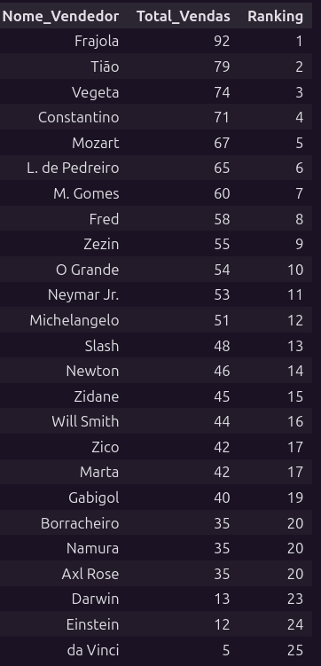
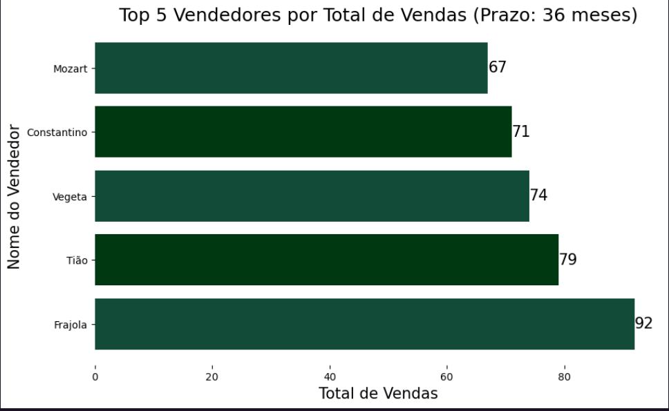
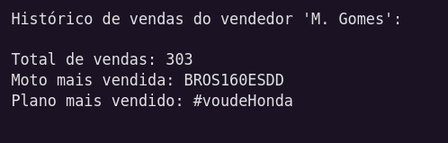
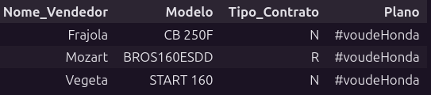
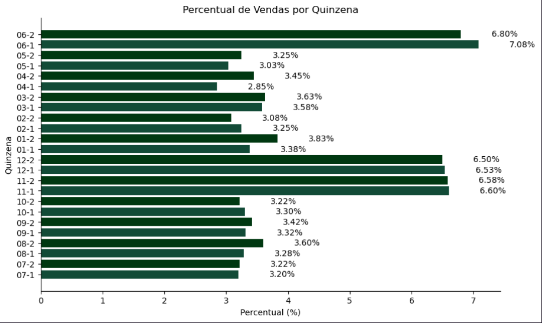
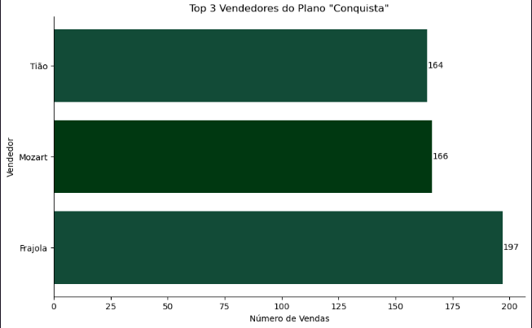
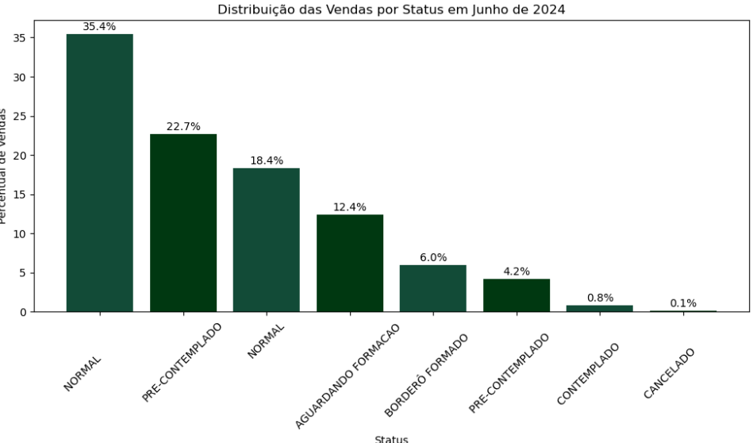
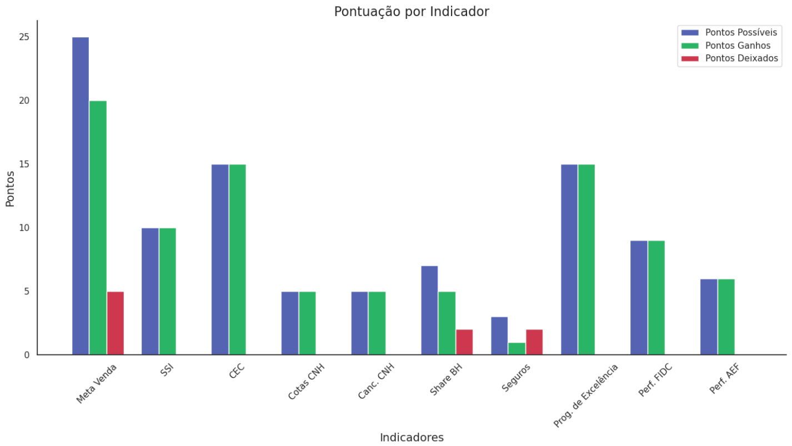

# Análise de dados Graúna Motos

## Sumario dos dados
1. **CPF_Vendedor**: CPF do vendedor responsável pela venda.
2. **Nome_Vendedor**: Nome do vendedor responsável pela venda.
3. **Data_da_Venda**: Data em que a venda foi realizada.
4. **Prazo**: Prazo de pagamento acordado para a venda, em meses.
5. **Tipo_Contrato**: Tipo de contrato associado à venda.
6. **Modelo**: Modelo do veículo vendido.
7. **Status**: Status da venda.
8. **Cliente**: Nome do cliente que realizou a compra.
9. **Município**: Município onde a venda foi realizada.
10. **Parcela**: Valor da parcela do financiamento.
11. **Valor_Moto**: Valor total da moto vendida.
12. **Data_da_Contemplação**: Data de contemplação, se aplicável.
13. **Tipo_de_Contemplação**: Tipo de contemplação, se aplicável.
14. **Proposta**: Número da proposta de venda.
15. **Vl_total_amortizado**: Valor total amortizado pelo cliente até o momento.
16. **Vl_Quitação**: Valor necessário para quitação do financiamento.
17. **Plano**: Plano de financiamento associado à venda.
18. **Seguro_de_Vida**: Indica se a venda inclui seguro de vida (Sim/Não).

## Qual o prazo que mais vende?
O prazo que mais vende é: 36 meses

##  Qual a Cidade que tem maior participação na venda da Pop110 no período de 36 meses?
A cidade com maior participação na venda de Pop 110 é: BALSAS

##  Ranking de vendas por vendedor do período.

## Top 5

## Histórico de vendas do vendedor "M. Gomes"

## Quais as características dos top 3 vendedores (qual modelo mais vendem, tipo de contrato e plano)? 

## % de vendas por quinzena no período.

Analisando esse gráfico, é possível perceber uma sazonalidade. Os meses com maiores números de vendas são junho, dezembro e novembro. Tendo essa informação em vista, é possível tomar algumas decisões, como fazer uma campanha de marketing para otimizar as vendas ou uma promoção para tentar aumentar a demanda nos meses com menos vendas. São pontos a serem observados.

## Quem são os top 3 vendedores que mais vendem o plano "Conquista"? 

## Qual a participação percentual das vendas com seguro do vendedor "Tião" em Balsas?
A participação percentual das vendas com seguro do vendedor Tião em Balsas é: 49.12%

## Qual o vendedor mais atuante em Balsas vendendo contratos do tipo "N" em prazos maiores (60, 72 e 80 meses)? 
O vendedor mais atuante em Balsas vendendo contratos do tipo 'N' em prazos maiores é: Vegeta

## Distribuição das vendas do mês de junho de 2024 por status. 

# Análise dos indicadores

## Desempenho Geral:

Foram possíveis 100 pontos no total, dos quais foram ganhos 91 pontos. Isso indica um desempenho geral de 91%, o que é bastante positivo.

## Indicadores com Pontos Máximos:

SSI, CEC, Cotas CNH, Canc. CNH, Prog. de Excelência, Perf. FIDC, Perf. AEF: Estes indicadores atingiram todos os pontos possíveis, demonstrando que as metas nesses aspectos foram completamente alcançadas.
Indicadores com Pontos Deixados:

## Meta Venda: 
5 pontos deixados. Apesar de ter um bom desempenho (20/25), há margem para melhorar as vendas.
## Share BH: 
2 pontos deixados. Indicando que a Share BH não atingiu completamente a meta.
## Seguros: 
2 pontos deixados. Este indicador teve o desempenho mais baixo relativo aos pontos possíveis, sugerindo que o setor de seguros precisa de atenção.

## Áreas de Melhor Desempenho:

Prog. de Excelência, SSI, CEC: Estes indicadores alcançaram a pontuação máxima e são áreas de grande desempenho e sucesso.

## Áreas para Melhorar:

## Seguros: 
Com apenas 1 ponto ganho dos 3 possíveis, esta área mostra a maior necessidade de melhoria.

## Share BH e Meta Venda: 
Estes indicadores também têm espaço para melhoria, com pontos deixados de 2 e 5, respectivamente.

## Insights e Recomendações
Foco no Setor de Seguros:

Considerando que "Seguros" teve o desempenho mais baixo, pode ser útil investigar os motivos para essa pontuação e implementar estratégias para melhorar. Isso pode incluir treinamento da equipe, revisão das ofertas de produtos, ou estratégias de marketing mais eficazes.
Aprimorar Estratégias de Vendas:

Com 5 pontos deixados na "Meta Venda", há uma oportunidade significativa para aumentar as vendas. Revisar e ajustar estratégias de vendas, identificar obstáculos e explorar novas oportunidades de mercado pode ser benéfico.
Revisão da Partilha de BH:

Com 2 pontos deixados, vale a pena analisar as atividades relacionadas ao "Share BH" para entender como podem ser otimizadas.
Reconhecimento e Manutenção de Áreas de Sucesso:

É importante reconhecer e continuar a reforçar as práticas que levaram ao sucesso em "SSI", "CEC", "Cotas CNH", "Canc. CNH", "Prog. de Excelência", "Perf. FIDC" e "Perf. AEF". Manter esses altos padrões e buscar inovações contínuas pode ajudar a manter a excelência.
